# Fluttartur Tutorial

## Introduction

This project is an implementation of the board game "The Resistance: Avalon" as a mobile application using Flutter technology. The goal of the application is to simulate a multiplayer game session for 5 to 10 players. It facilitates gameplay in the absence of a physical copy of the game, providing a local multiplayer experience.

Players are randomly divided into good and evil teams. Evil players know each other at the beginning of the game, while good players remain uncertain about others' teams until the end of the game. The gameplay involves selecting squads for quests, with the majority of players voting for the chosen squad. The outcome of each quest is determined by a secret vote among the selected squad members.

The game is won by the good side if three out of five quests are successful, while the evil side wins if three out of five quests fail.

## Game Session Flow

1. **Room Setup:**
   - One player (host) creates a room.
   - Players join the room using a session code.

2. **Character Selection:**
   - The host selects the game version, including character options.
   - Teams are randomly assigned to each player, with additional information for evil players about the identities of other evil players.

3. **Game Start:**
   - The leader selects a squad for the first quest.
   - Open voting on the squad selection (majority wins).
   - Secret voting on the quest success or failure.

4. **Quest Outcome:**
   - Players learn the result of the quest.
   - Leadership shifts to the next player.
   - The game continues until three successful or three failed quests.

## Detailed instructions

### Logging In

Upon installation and launch, users are greeted with the login screen. They can change the language between Polish and English using the flag buttons. Users can log in using a previously registered email and password, log in with a Google account, or proceed to the registration screen. The email and password fields undergo validation.

  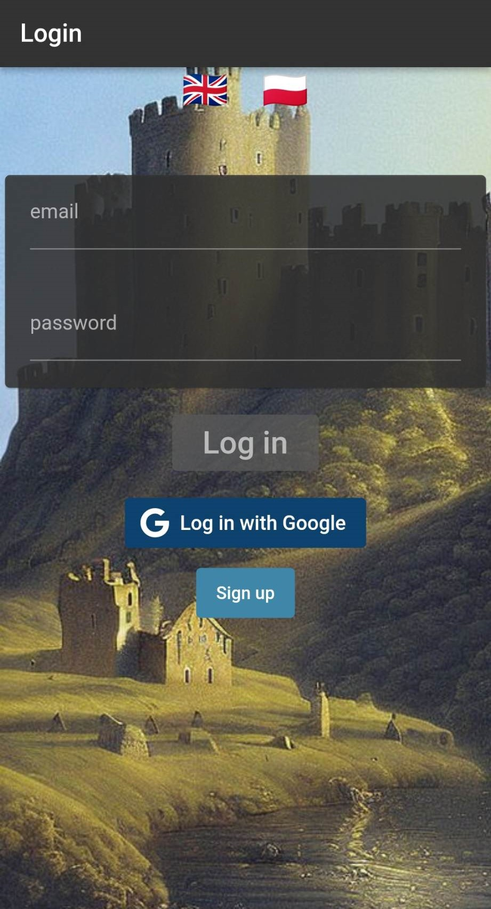
  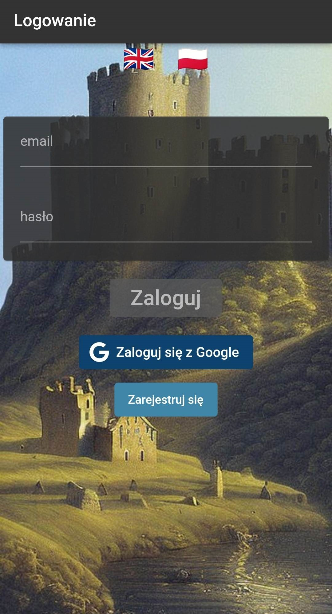 

### Registration

If users want to create a new account, they can proceed to the registration screen. After entering their email and password, users can click the registration button. They are then directed to the Lobby screen, and they can use the created account for regular login.

  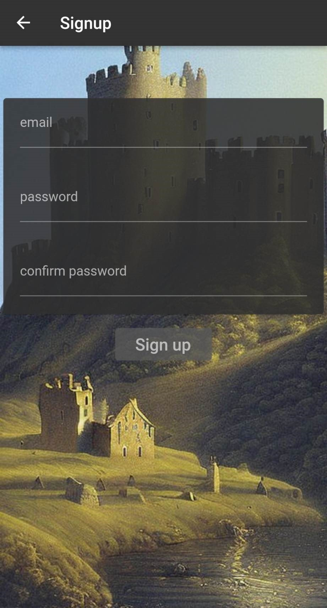
  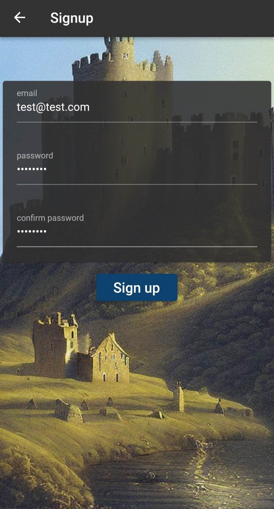 

### Lobby

In the Lobby screen, users can change the language, enter a room ID to join, create a new room, or log out.

  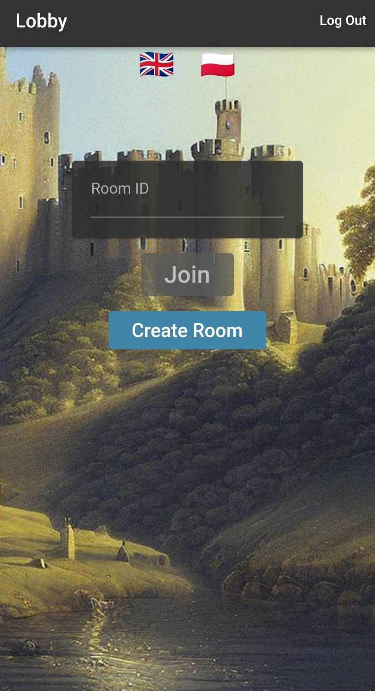
  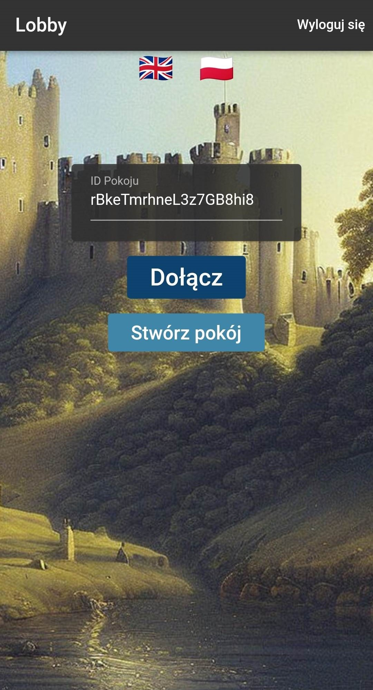 

### Room

Upon entering a room, users must set their nickname, visible to other players. The host has additional options to copy the room ID, kick players, modify character lists, and start the game.

  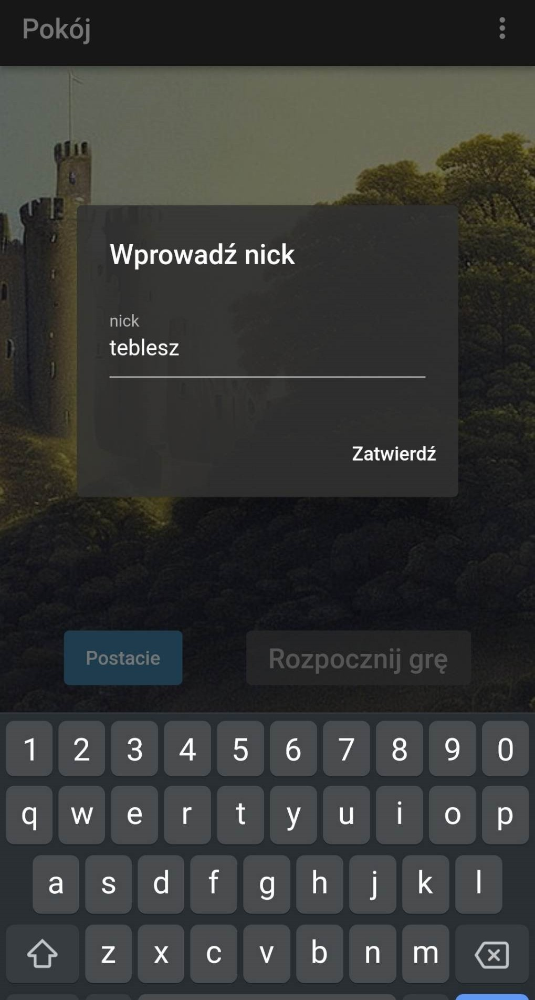
  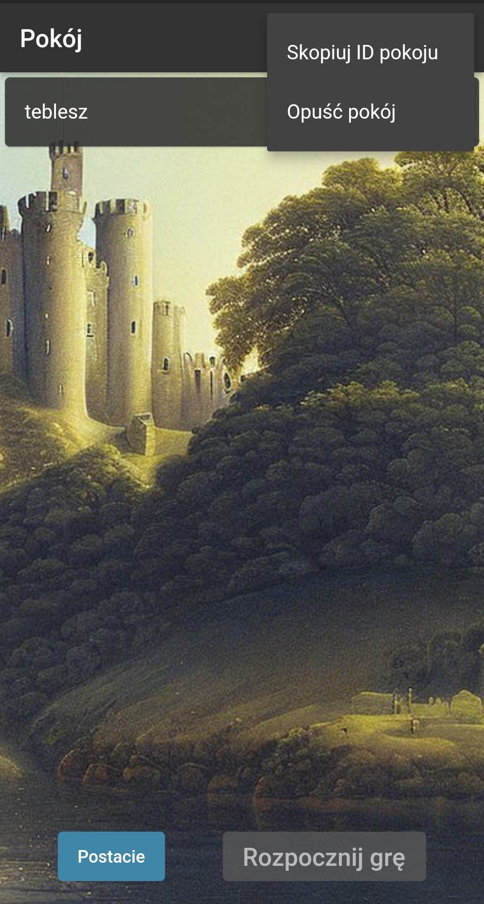
  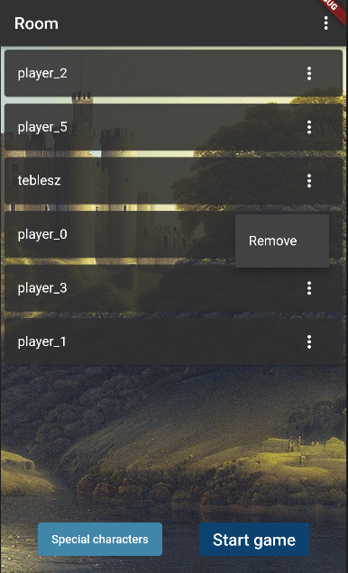

### Characters

In the Characters screen, the room host can define additional characters that will participate in the game.

  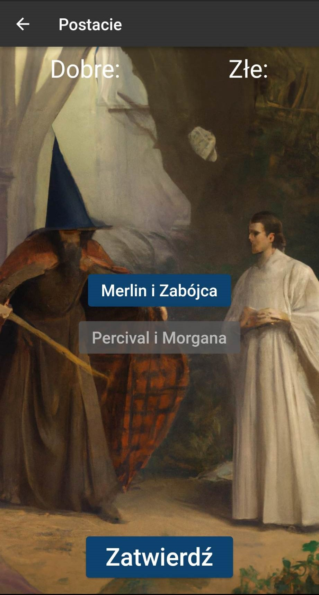
  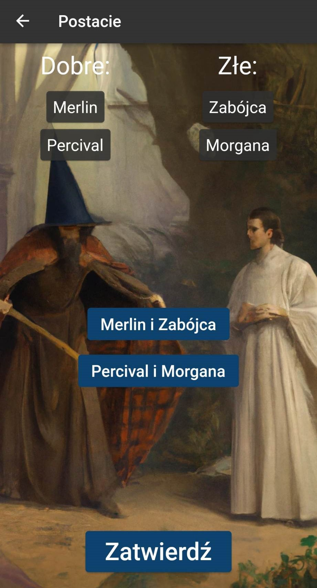 

### Gameplay

After starting the game, players are redirected to the game screen. The game screen includes a quest panel, a player list, a squad list, and buttons for various actions during the game.

  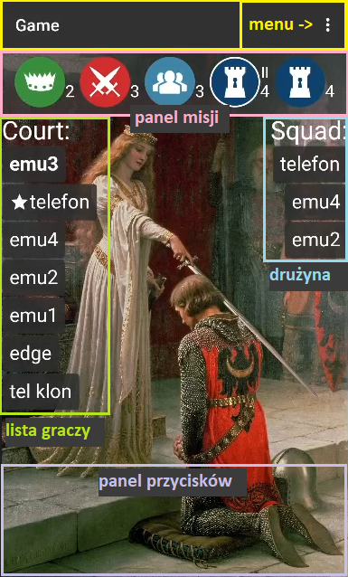

### Start of Game

Players are informed about their assigned teams and, if applicable, additional characters assigned to them. Evil players receive information about other evil players, hidden behind a button for secrecy.

  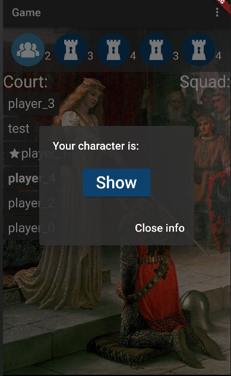
  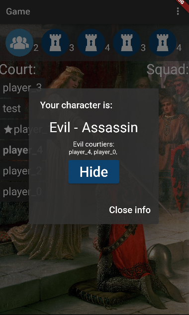
  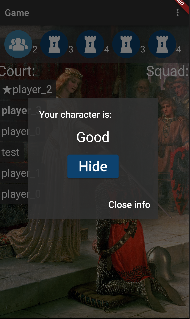

### Squad Selection

The leader selects a squad for the quest. The squad members are chosen from the player list. The selected squad goes through open voting by all players.

  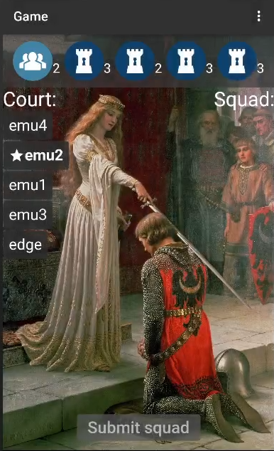
  
  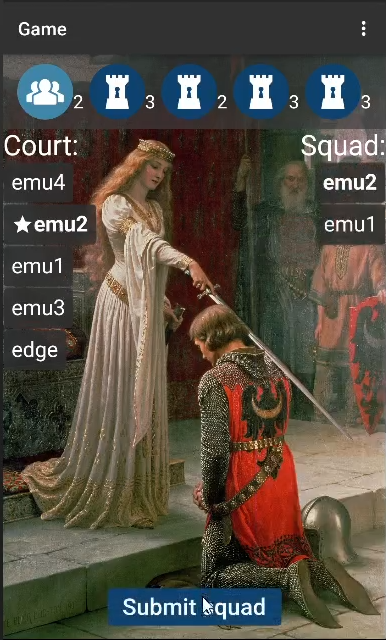

### Public Vote on squad

The selected squad undergoes public voting. If the majority approves, the squad is accepted, and players move to the secret voting screen.

  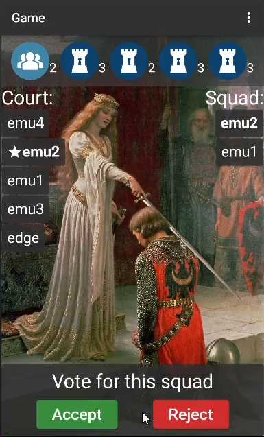
  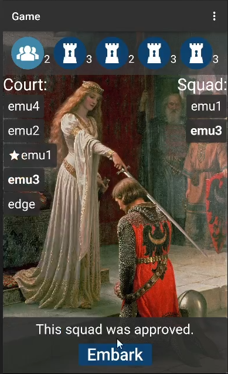

### Secret Vote on quest

Squad members vote secretly on the success or failure of the quest. Good players can only vote for success, while evil players have the option to vote for success or failure.

  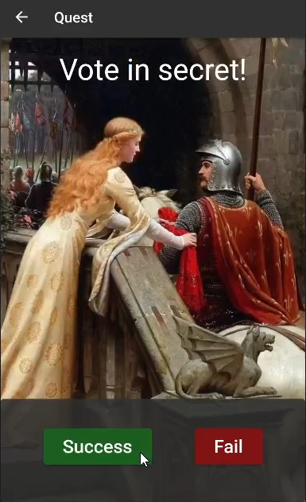

### Quest Result

After all squad members vote, the players see the result of the quest. The game returns to the squad selection phase with a new leader if three quests were successful or three quests failed.

  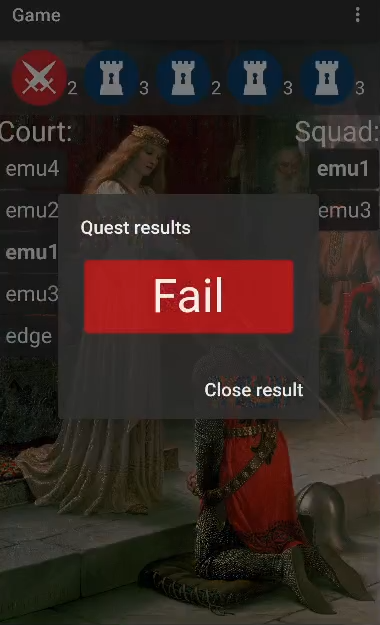
  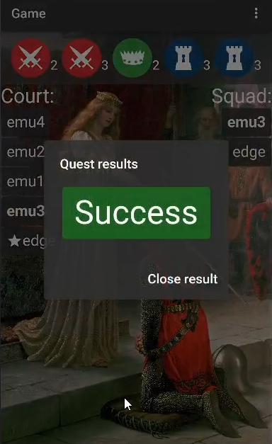 

Upon completion of three successful or three failed quests, the game concludes. A final screen displays the outcome, and players learn the identities of evil players. If Merlin and the Assassin were in the game, the Assassin can choose Merlin after a good side victory, potentially changing the game result.

### Game Result

The end-of-game screen informs players about the victory of either the good or evil side. Evil players discover the identity of Merlin, and the final result is displayed.

After the game, players can click the exit button to return to the Lobby screen.

  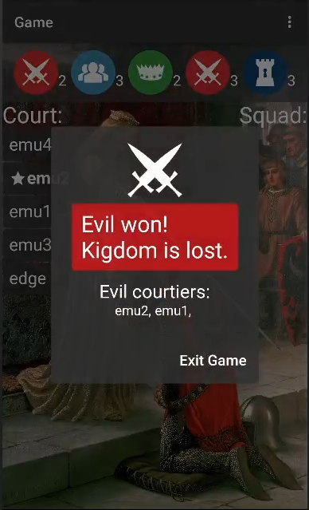
  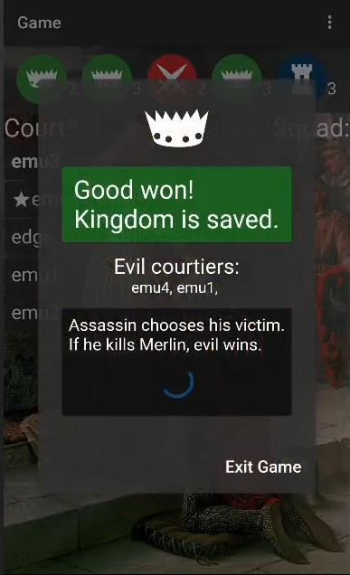
  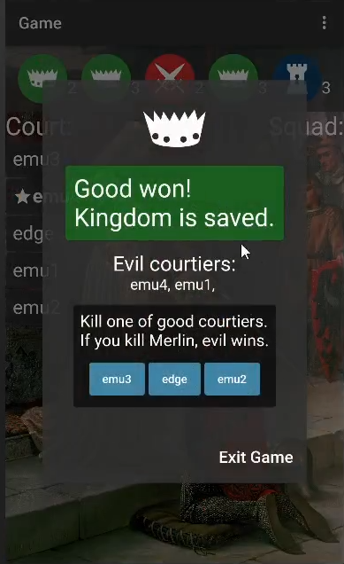

